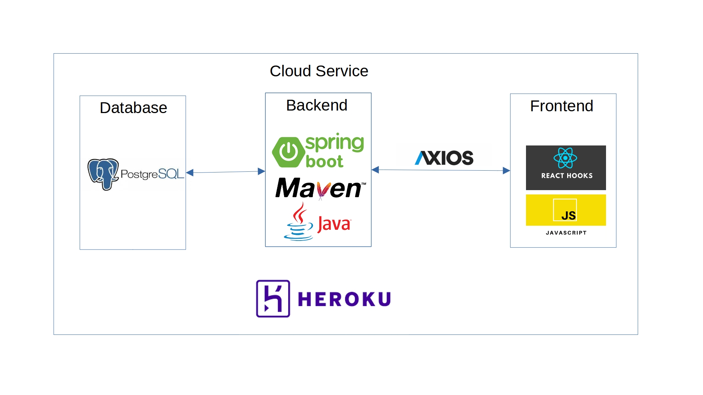

# Descrição
Aplicativo permite a consulta e cadastro de clientes através do CPF (chave de negócio), nome e telefone.
# Características
- Buscar cadastro por CPF
  - se o campo "buscar CPF" estiver em branco será retornada a lista completa dos clientes
- Cadastrar cliente
  - se o CPF já estiver cadastrado os dados do cliente serão atualizados
## [Acesse o Aplicativo Aqui](https://teste-vivo-frontend.herokuapp.com/)
# Backend
- Para detalhes e documentação do backend acesse [backend](https://github.com/rafaeuz/vivoBack)

# Arquitetura da Solução

